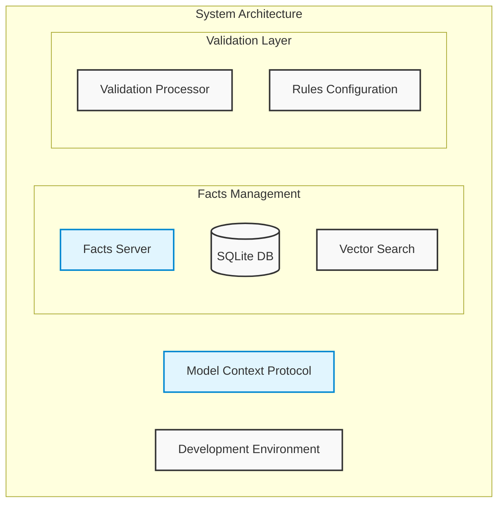
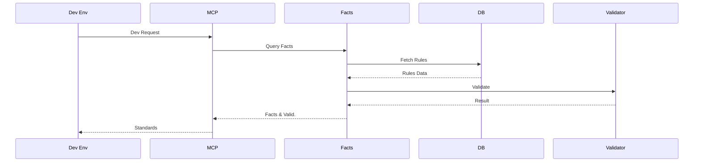

# AutoArch

A development automation system that uses the Model Context Protocol (MCP) to manage and enforce architectural decisions, coding standards, and development guidelines.

## System Overview

### System Architecture



### Request Flow



The architecture diagram shows the core components of AutoArch, centered around the Model Context Protocol (MCP) which integrates with your development environment. The Facts Server manages development guidelines and standards using a SQLite database with vector search capabilities.

The sequence diagram illustrates the flow of a typical development request through the system, showing how facts are retrieved, validated, and enforced to maintain consistent standards throughout your project.

## Features

- **Facts Management**: Store and retrieve development decisions, guidelines, and standards
- **Automated Validation**: Validate code changes against established criteria
- **Flexible Categories**: Support for multiple development aspects (frontend, backend, security, etc.)
- **Configurable Rules**: Adjustable strictness levels for different types of guidelines

## Project Structure

```
autoarch/
├── facts-server/        # MCP server for facts management
│   ├── src/            # TypeScript source files
│   ├── prisma/         # Database schema and migrations
│   └── build/          # Compiled JavaScript output
└── .clinerules         # Configuration for facts integration
```

## Getting Started

### Prerequisites
- Node.js
- SQLite
- MCP SDK

### Installation
1. Clone the repository
2. Install dependencies:
   ```bash
   cd facts-server
   npm install
   ```
3. Build the project:
   ```bash
   npm run build
   ```

### Configuration

The `.clinerules` file configures how facts are managed:

- Automatic saving of development decisions
- Validation of proposals against existing facts
- Strictness levels for different fact types
- Category mappings for various development aspects

## Usage

### Running the Facts Server
```bash
cd facts-server
npm start
```

### Interacting with Facts

The facts server provides the following tools:
- Create/update facts
- Search facts by type, strictness, and version
- Validate content against fact criteria
- Retrieve existing facts

## Development

### Available Scripts
- `npm run build` - Build the TypeScript code
- `npm run dev` - Run with debugging enabled
- `npm start` - Start the facts server

### Technology Stack
- TypeScript
- Prisma (SQLite)
- MCP SDK
- Vector extensions for similarity search

## License

This project is licensed under the MIT License - see the [LICENSE](LICENSE) file for details.
